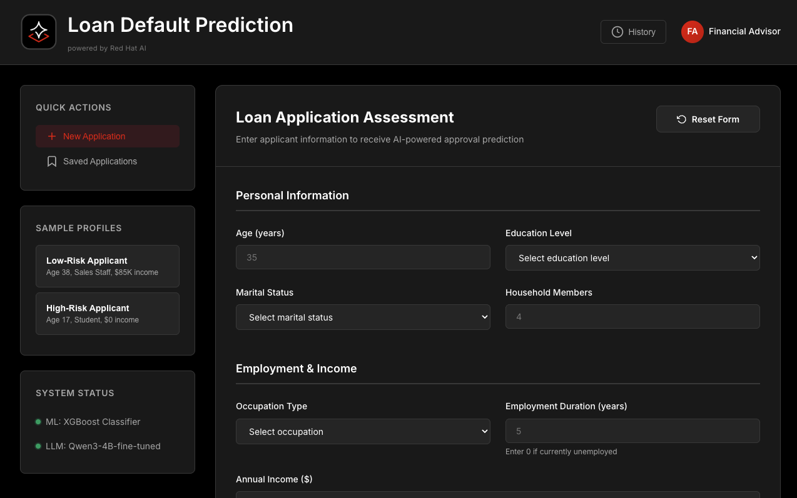

# Micro Financial Loan Approval with Predictive & Generative AI

This project demonstrates the ease of bringing AI to enterprise on Red Hat AI platform. 
This covers machine learning model development, LLM model fine tuning, inference and hosting a web application to combine both predictive and generative AI use case.  

## Pre-requisites
View the requirements in [docs.redhat.com](https://docs.redhat.com/en/documentation/red_hat_openshift_ai_self-managed/3.0) to install Red Hat AI Self-Managed.

The project goes through:
* Deploy S3 compatible object store (MinIO)
* Train a classification model with sci-kit learn and custom dataset
  *  [predictive-model-development.ipynb](./predictive-model-development.ipynb)
* Fine tune Qwen3 reasoning model with custom dataset
  *  [llm-model-fine-tuning.ipynb](./llm-model-fine-tuning.ipynb)
* Create inference API for predictive model and generative model
* Deploy a web application to consume predictor models

Additionally, this will also cover:
* AI Pipeline automation (To be added)
* MLOps - Version control (To be added) 
* MLOps - Monitoring & Observability (To be added)